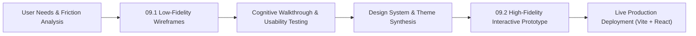
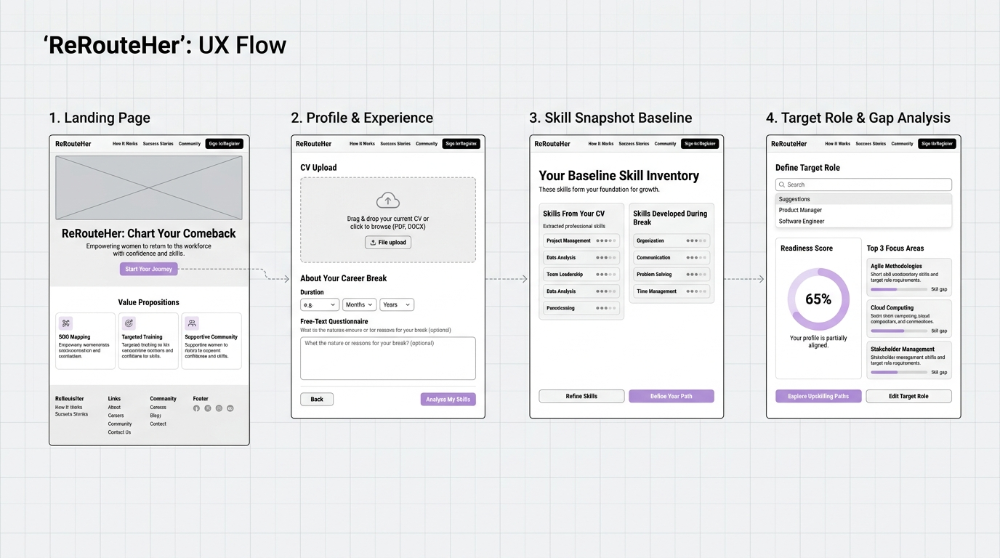
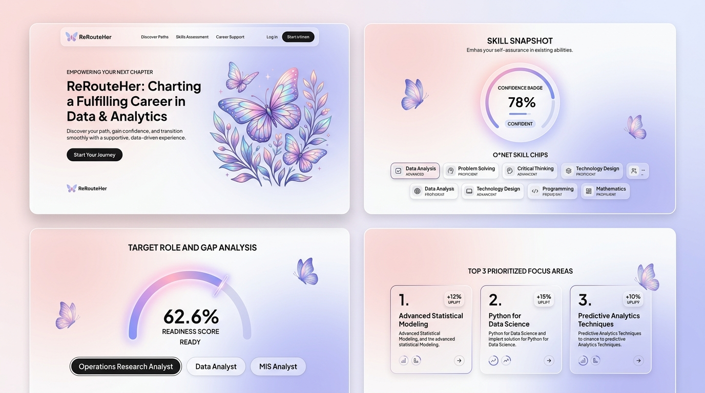
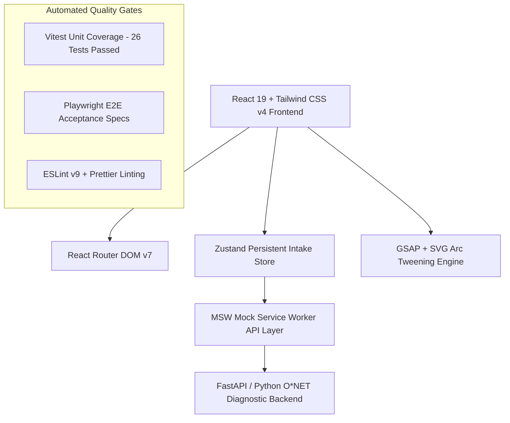

# 📱 09 · Low-Fidelity & High-Level (Hi-Fi) Interactive Prototypes

> **Project**: ReRouteHer — AI-Powered Skill Readiness & Career Re-entry Platform  
> **Course / Team Code**: `5120-TM07`  
> **Figma Canvas**: [5120-TM07 Figma Design File](https://www.figma.com/design/wwl5kUAg2RJF8anRURdf1n/5120-TM07?node-id=0-1&t=8vvvEvjkLIAUzMhL-1)  
> **Live Interactive Prototype**: [https://prototype.curl.my/](https://prototype.curl.my/)  
> **GitHub Repositories**: [`ryus0006/rerouteher-ui`](https://github.com/ryus0006/rerouteher-ui) & [`ncm233/reroutehers-prototype`](https://github.com/ncm233/reroutehers-prototype)

---

## 1. Executive Summary & Prototyping Objectives

Returning to formal employment after a prolonged caregiving career break is fraught with severe emotional and cognitive hurdles: returners frequently experience **imposter syndrome**, struggle to articulate their transferable capabilities, and encounter a **"wall of 20+ overwhelming job requirements"** on traditional job boards.

**ReRouteHer** addresses this gap through an empathy-led, data-backed career re-entry readiness engine. The prototyping phase followed an iterative double-diamond design lifecycle, progressing from conceptual low-fidelity (Lo-Fi) structural wireframes to a high-level, interactive high-fidelity (Hi-Fi) prototype.



---

## 2. Low-Fidelity (Lo-Fi) Prototypes & Wireframe Architecture

### 2.1 Design Rationale & Information Hierarchy
The initial low-fidelity wireframes established the foundational four-step sequential journey, deliberately stripping away aesthetic styling to validate:
1. **Zero-Friction Intake**: Eliminating multi-page tedious forms in favor of an automated two-step input (CV document parsing + natural language career break description).
2. **Reflective vs. Exploratory Separation**: Separating the *historical baseline* (Skill Snapshot — where she is coming from) from the *aspirational target* (Target Role & Gap — where she wants to aim).
3. **Anti-Overwhelm Focus**: Guaranteeing a maximum cap of **3 actionable focus areas**, replacing demoralizing comprehensive requirement checklists.



### 2.2 Screen-by-Screen Lo-Fi Breakdown

| Stage | Lo-Fi Screen Name | Key Functional Modules & Layout Strategy | User Experience Intent |
| :--- | :--- | :--- | :--- |
| **01** | **Landing Page** | • Minimalist top navigation with brand mark<br>• Hero header with bold value proposition<br>• Prominent primary CTA button (`Start Your Journey`)<br>• 3-column value cards (Break Experience, Weighted Score, Top 3 Focus) | Instills immediate confidence and sets clear expectations of zero manual friction. |
| **02** | **Profile & Experience Intake** | • Drag-and-drop CV upload dropzone (PDF/DOCX)<br>• Duration selector (0.5 to 15 years)<br>• Free-text multi-line textarea with example suggestion chips | Bypasses repetitive form fields, allowing returners to express real-world experiences in their own words. |
| **03** | **Baseline Skill Snapshot** | • Non-locking "Background Baseline" header<br>• Two-column skill container: *Extracted CV Skills* vs. *Reframed Break Skills*<br>• O*NET crosswalk indicator badge | Validates both professional achievements and caregiving competencies on an equal footing. |
| **04** | **Target Role & Gap Analysis** | • Interactive target role selector tabs<br>• Semicircular readiness gauge displaying current baseline %<br>• Capped Top 3 focus areas with projected readiness boost tags<br>• "Explore Upskilling Paths" CTA | Replaces failure anxiety with an actionable, bite-sized growth plan. |

---

## 3. High-Fidelity (Hi-Fi) Interactive Prototype

The high-fidelity prototype transforms the validated wireframes into a soothing, empowering, state-of-the-art interactive web application.



### 3.1 Design System & Visual Language

#### **A. Color Palette & Emotional Tone**
The color palette was meticulously chosen to evoke warmth, empowerment, and cognitive clarity, avoiding clinical or aggressive job-portal aesthetics.

```
┌────────────────────────────────────────────────────────────────────────────────────────┐
│ ReRouteHer Design Tokens & Color Palette                                               │
├───────────────────┬──────────────┬──────────────┬──────────────────────────────────────┤
│ Token Name        │ Hex Code     │ Tailwind / CSS│ Semantics & Psychological Function   │
├───────────────────┼──────────────┼──────────────┼──────────────────────────────────────┤
│ Primary Blush Pink│ `#DE8BA8`    │ `--pink-500` │ Metamorphosis, empathy, primary CTA  │
│ Soft Lavender     │ `#B4A2D4`    │ `--violet-400│ Transmutation, cognitive calming     │
│ Periwinkle Blue   │ `#7E92CA`    │ `--blue-600` │ Trust, professional stability        │
│ Mint Green        │ `#337857`    │ `--mint-600` │ O*NET validated break achievements   │
│ Amber Gold        │ `#96540D`    │ `--amber-700`│ Priority uplift badges (+% gain)     │
│ Midnight Ink      │ `#262B4A`    │ `--ink`      │ High-contrast primary typography     │
│ Frosted Canvas    │ `#FCF8FA`    │ `--grad-soft`│ Multi-stop ethereal page background  │
└───────────────────┴──────────────┴──────────────┴──────────────────────────────────────┘
```

#### **B. Typography**
- **Headings & Accents**: `Bricolage Grotesque` / `Familjen Grotesk` — Expressive, humanistic, and approachable display type.
- **Body & Data Displays**: `Plus Jakarta Sans` — Crisp, legible geometric sans-serif engineered for digital interfaces.

#### **C. Frosted Glassmorphism Components**
All primary containers leverage frosted glassmorphism (`backdrop-filter: blur(24px); background: rgba(255,255,255,0.75);`) with multi-layered subtle specular borders, creating depth while keeping the overall layout airy and lightweight.

---

### 3.2 Detailed Hi-Fi Screen Specifications

```carousel

<!-- slide -->

```

#### **Screen 1 · Landing & Value Proposition (`/`)**
- **Hero Artwork**: Ethereal multi-layered butterfly oil painting artwork with radial alpha-mask gradient blending.
- **Journey Stepper**: 3-step interactive visual road (`1. Upload CV` ➔ `2. Describe break` ➔ `3. See fit & top gaps`).
- **Parallax Scroll Effects**: Dynamic background light orbs and staggered reveal animations built with GSAP and ScrollTrigger.

#### **Screen 2 · 2-Stage Intake (`/diagnostic/background` & `/diagnostic/break`)**
- **Stage 1 (CV Dropzone)**: Mandatory client-side verified drag-and-drop supporting `.pdf` and `.docx` up to 10MB, plus 1-click sample CV loaders for instant evaluation.
- **Stage 2 (Career Break NLP)**: Dual-input system featuring a smooth duration range slider (0.5 to 15 years) and a natural language textarea with one-tap suggestion chips (`+ Childcare`, `+ Budgeting`, `+ Volunteering`, `+ Self-study`).

#### **Screen 3 · Read-Only Skill Snapshot (`/diagnostic/snapshot`)**
- **Occupation Baseline Card**: Displays the classifier-matched role (e.g. *Operation Research Analyst* or *Senior UX/UI Designer*) with a `High confidence match` mint badge, emphasizing that this is a read-only historical reflection, not a locked constraint.
- **Two-Column Skill Inventory**:
  - **From your CV**: Extracted competencies displayed as compact pill chips (`SkillChip`) with hover tooltips revealing exact source evidence; collapsible with `Show all` toggle when exceeding 12 items.
  - **From your career break**: O*NET-reframed competencies highlighted in soft mint tones (`Active Listening`, `Social Perceptiveness`, `Time Management`, `Coordination`, `Management of Financial Resources`).
- **O*NET Crosswalk Bridge**: Banner explaining how real-world domestic and community tasks map directly into federal competency databases.

#### **Screen 4 · Target Role & Readiness Gap Diagnostic Engine (`/diagnostic/gap`)**
- **Interactive Role Selector**: Pill selector tabs allowing instant switching between target roles:
  1. `Operation Research Analyst` (`Closest match` — 62.6% Baseline ➔ 84.3% Target)
  2. `Data Analyst` (71.4% Baseline ➔ 88.9% Target)
  3. `Management Information Systems (MIS) Analyst` (68.0% Baseline ➔ 86.5% Target)
- **210° Arc Readiness Gauge**: Animated SVG sweep gauge indicating `62.6% READY TODAY`, paired with a high-visibility projected summary banner: `62.6% today → 84.3% after your focus areas`.
- **Ranked Top 3 Focus Areas**:
  1. `Mathematics (O*NET Skill)` — `Role skill` — `+6.7% if learned`
  2. `Use AI Assistants for Everyday Work Tasks` — `AI literacy` — `+7.5% if learned`
  3. `Check and Verify AI Output` — `AI literacy` — `+7.5% if learned`
- **Transparent Formula Card**: Educates the returner that scores are **importance-weighted**, rewarding foundational core skills while maintaining realistic growth expectations.

---

## 4. Technical Prototype Architecture & Verification

The prototype was constructed using modern industry-grade web frameworks to ensure rapid iteration, accessibility compliance, and production fidelity.



### 4.1 Technology Stack Matrix
- **UI Framework**: React 19 (Functional Components & Custom Hooks)
- **Styling Architecture**: Tailwind CSS v4 + Vanilla CSS Design Tokens
- **State Management**: Zustand lightweight reactive store with local persistence
- **Animation & Transitions**: GSAP 3.12 (GreenSock) for high-performance physics-based timeline animations
- **Mock & Data Layer**: MSW (Mock Service Worker 2.15) for identical client-server REST contract emulation
- **Quality Assurance**: Vitest (Unit & Coverage) + Playwright (End-to-End browser test automation)

---

## 5. Usability Evolution & Design Refinement Log

| Iteration Phase | Identified User Pain Point / Feedback | Implemented Design Solution in Hi-Fi Prototype |
| :--- | :--- | :--- |
| **Lo-Fi Wireframe** | Generic role selection felt restrictive and forced returners into boxes. | Introduced the **Read-Only Skill Snapshot** step as a reflective baseline before prompting role selection. |
| **Initial Hi-Fi (v1.0)** | AI literacy skills flooded the focus list, crowding out domain technical requirements. | Implemented the **`pickFocusAreas` algorithm**: guarantees 1 AI-literacy slot and reserves remaining slots for core domain role skills. |
| **User Feedback (v1.1)** | Long CV skill lists created vertical scrolling clutter. | Created compact pill chips (`SkillChip`) with hover evidence tooltips and a `Show all / Show fewer` collapse toggle. |
| **Team Review (v2.0)** | Disconnect between raw skill count (e.g. 7 of 10) and percentage score (62.6%). | Added the **Importance-Weighted Formula Card**, clearly explaining weighting factors and O*NET skill benchmarks. |

---

## 6. Access Links & Verification Instructions

- 🔗 **Figma Design Canvas**: [https://www.figma.com/design/wwl5kUAg2RJF8anRURdf1n/5120-TM07](https://www.figma.com/design/wwl5kUAg2RJF8anRURdf1n/5120-TM07?node-id=0-1&t=8vvvEvjkLIAUzMhL-1)
- 🌐 **Live Deployed Prototype**: [https://prototype.curl.my/](https://prototype.curl.my/)
- 💻 **Local Development Execution**:
  ```bash
  # Install dependencies
  npm install

  # Run interactive development server
  npm run dev

  # Run automated test suite
  npm run test:unit
  ```
